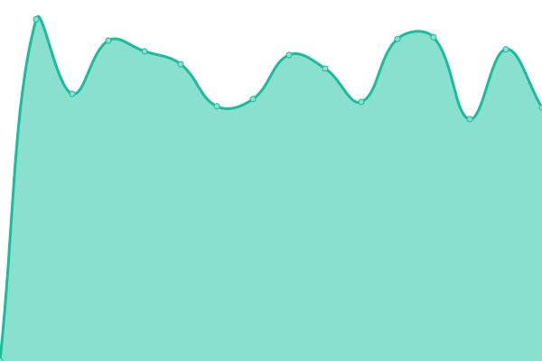

# [📈 Live Status](https://nguyenvanthi.github.io/uptime): <!--live status--> **🟩 All systems operational**

<!--start: status pages-->
<!-- This summary is generated by Upptime (https://github.com/upptime/upptime) -->
<!-- Do not edit this manually, your changes will be overwritten -->
<!-- prettier-ignore -->
| URL | Status | History | Response Time | Uptime |
| --- | ------ | ------- | ------------- | ------ |
|  [[Trio Beta] User Service](https://user-service.uat.s2tek.net/health) | 🟩 Up | [trio-beta-user-service.yml](https://github.com/nguyenvanthi/uptime/commits/HEAD/history/trio-beta-user-service.yml) | 

 783ms
     
 | 

<a href="https://nguyenvanthi.github.io/uptime/history/trio-beta-user-service">99.83%</a>
    

|  [[Trio Beta] Gateway Service](https://gateway-service.uat.s2tek.net/health) | 🟩 Up | [trio-beta-gateway-service.yml](https://github.com/nguyenvanthi/uptime/commits/HEAD/history/trio-beta-gateway-service.yml) | 

 784ms
     
 | 

<a href="https://nguyenvanthi.github.io/uptime/history/trio-beta-gateway-service">99.83%</a>
    

|  [[Trio Beta] CMS Client](https://cms-client.uat.s2tek.net/) | 🟩 Up | [trio-beta-cms-client.yml](https://github.com/nguyenvanthi/uptime/commits/HEAD/history/trio-beta-cms-client.yml) | 

 785ms
     
 | 

<a href="https://nguyenvanthi.github.io/uptime/history/trio-beta-cms-client">99.67%</a>
    

|  [[Trio Alpha] User Service](https://user-service.trio.s2tek.net/health) | 🟩 Up | [trio-alpha-user-service.yml](https://github.com/nguyenvanthi/uptime/commits/HEAD/history/trio-alpha-user-service.yml) | 

 773ms
     
 | 

<a href="https://nguyenvanthi.github.io/uptime/history/trio-alpha-user-service">99.68%</a>
    

|  [[Trio Alpha] Gateway Service](https://gateway-service.trio.s2tek.net/health) | 🟩 Up | [trio-alpha-gateway-service.yml](https://github.com/nguyenvanthi/uptime/commits/HEAD/history/trio-alpha-gateway-service.yml) | 

 749ms
     
 | 

<a href="https://nguyenvanthi.github.io/uptime/history/trio-alpha-gateway-service">99.57%</a>
    

|  [[Trio Alpha] CMS Client](https://cms-client.trio.s2tek.net/) | 🟩 Up | [trio-alpha-cms-client.yml](https://github.com/nguyenvanthi/uptime/commits/HEAD/history/trio-alpha-cms-client.yml) | 

 781ms
     
 | 

<a href="https://nguyenvanthi.github.io/uptime/history/trio-alpha-cms-client">99.73%</a>
    

|  [[S2tek Alpha] FS Server](https://fishing-card-server.s2tek.net/health) | 🟩 Up | [s2tek-alpha-fs-server.yml](https://github.com/nguyenvanthi/uptime/commits/HEAD/history/s2tek-alpha-fs-server.yml) | 

 735ms
     
 | 

<a href="https://nguyenvanthi.github.io/uptime/history/s2tek-alpha-fs-server">99.88%</a>
    

|  [[S2tek Alpha] FS Client](https://fishing-card-client.s2tek.net) | 🟩 Up | [s2tek-alpha-fs-client.yml](https://github.com/nguyenvanthi/uptime/commits/HEAD/history/s2tek-alpha-fs-client.yml) | 

 742ms
     
 | 

<a href="https://nguyenvanthi.github.io/uptime/history/s2tek-alpha-fs-client">99.88%</a>
    

|  [[DevOps] Synology](https://nas.s2tek.net) | 🟩 Up | [dev-ops-synology.yml](https://github.com/nguyenvanthi/uptime/commits/HEAD/history/dev-ops-synology.yml) | 

 948ms
     
 | 

<a href="https://nguyenvanthi.github.io/uptime/history/dev-ops-synology">99.88%</a>
    

|  [[DevOps] Prometheus](https://prometheus.s2tek.net/status) | 🟩 Up | [dev-ops-prometheus.yml](https://github.com/nguyenvanthi/uptime/commits/HEAD/history/dev-ops-prometheus.yml) | 

 716ms
     
 | 

<a href="https://nguyenvanthi.github.io/uptime/history/dev-ops-prometheus">99.88%</a>
    

<!--end: status pages-->

[**Visit our status website →**](https://nguyenvanthi.github.io/uptime)
